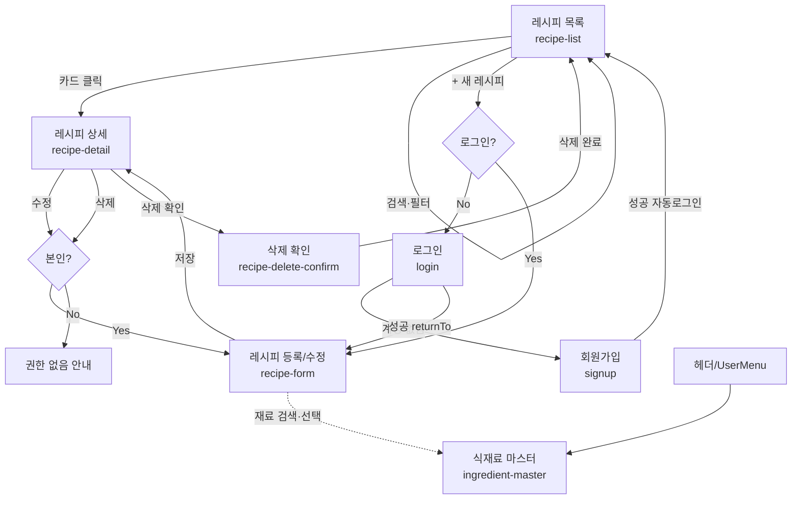
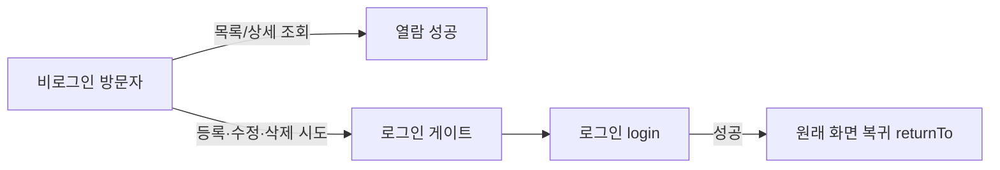
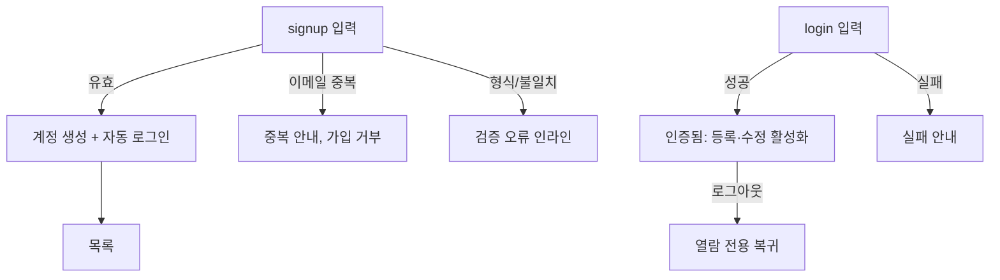
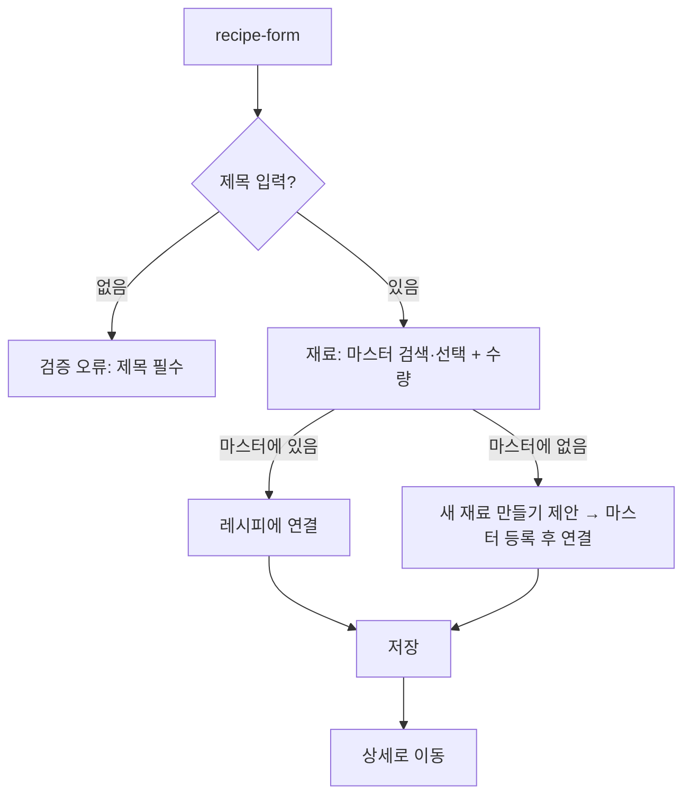
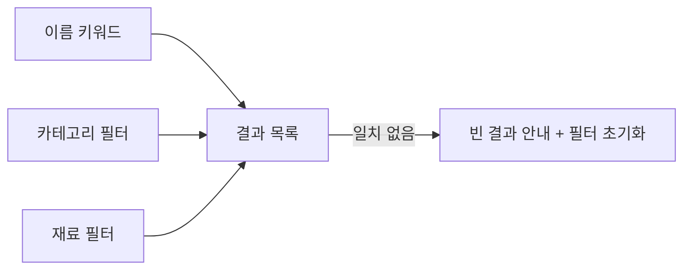
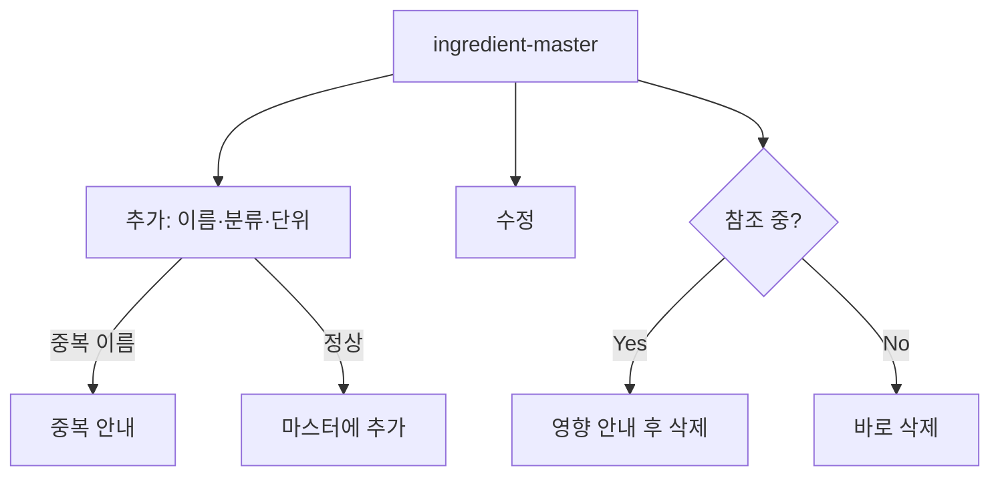

# 화면 흐름 (User Flows)

레시피 & 식재료 관리 웹서비스 — Must 범위(US-001~US-010). 각 흐름은 PRD 4절 수용 기준과 연결된다.

## 1. 전체 IA / 내비게이션

## 2. 비로그인 열람 + 로그인 게이트 (US-003)

- 목록/상세는 게이트 없이 열람 (US-003 AC1).
- 등록/수정/삭제 진입 시 100% 로그인 화면으로 유도, 동작은 수행 안 됨 (US-003 AC2, PRD 지표).

## 3. 회원가입 → 로그인 (US-001, US-002)

## 4. 레시피 등록 + 식재료 연결 (US-004, US-009)

## 5. 레시피 검색·필터 (US-010)

## 6. 식재료 마스터 관리 (US-008)

## 확장 여지 (이번 Must 범위 아님)
- **US-011/012 (Should)**: 재고 관리 화면 신설, 레시피 상세에 "부족/충족" 배지(상세 wireframe에 placeholder 존재).
- **US-013 (Could)**: 목록/검색 필터에 "내 재료로 만들 수 있는 레시피" 토글 추가.
