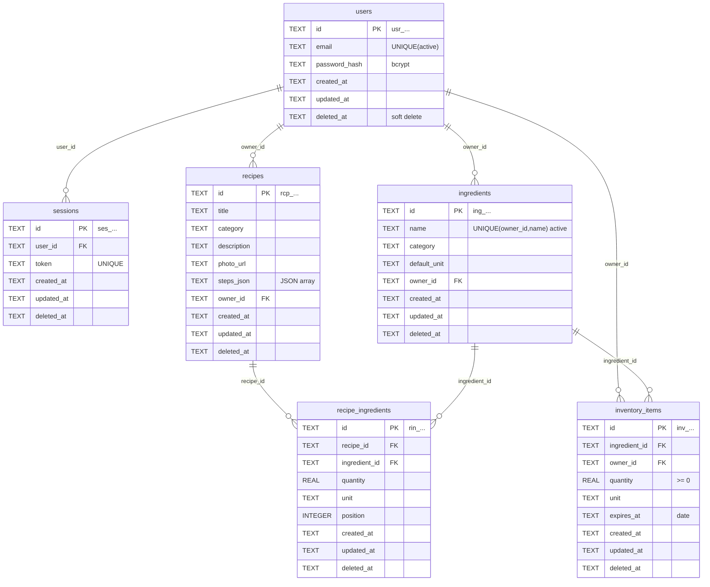

# DB 스키마 & 설계 결정 (server, G3)

- **엔진**: SQLite (파일 기반, 소규모 Q6-a 기준). 접속 파일 경로는 `DB_PATH` 환경변수.
- **스키마 관리**: `server/app/migrations/*.sql` 마이그레이션 파일로만 관리(수동 변경 금지).
  적용 이력은 `schema_migrations` 테이블에 기록해 중복 적용을 방지한다.
- **공통 규칙(api-conventions DB 규칙)**: 테이블명은 복수 snake_case, 모든 테이블에
  `id`, `created_at`, `updated_at` 보유. 삭제는 soft delete(`deleted_at IS NULL` = 활성).
- **타임스탬프**: ISO8601 UTC 문자열 `YYYY-MM-DDTHH:MM:SSZ` 로 저장(응답 date-time 포맷과 동일).
- **식별자**: `<prefix>_<ULID>` 형식(예 `usr_`, `rcp_`, `ing_`, `inv_`, `rin_`, `ses_`, `img_`).
  ULID는 시간 기반이라 사전식 정렬 = 생성순 → 커서 페이지네이션(id 내림차순=최신순)에 활용.

## ERD

## 테이블

### users
| 컬럼 | 타입 | 비고 |
|---|---|---|
| id | TEXT PK | `usr_...` |
| email | TEXT | 활성 행에 한해 UNIQUE (`ux_users_email_active`) |
| password_hash | TEXT | bcrypt 해시 |
| created_at / updated_at | TEXT | |
| deleted_at | TEXT NULL | soft delete |

### sessions
세션 쿠키 인증의 서버측 저장소. 쿠키 값은 `token.HMAC(SECRET_KEY)` 로 서명되어 위변조 탐지.
로그아웃 시 해당 사용자의 활성 세션을 soft delete.
| 컬럼 | 타입 | 비고 |
|---|---|---|
| id | TEXT PK | `ses_...` |
| user_id | TEXT FK→users | |
| token | TEXT UNIQUE | 불투명 랜덤 토큰 (인덱스 `ix_sessions_token`) |
| created_at / updated_at / deleted_at | TEXT | |

### ingredients (회원 개인별 마스터, US-008)
| 컬럼 | 타입 | 비고 |
|---|---|---|
| id | TEXT PK | `ing_...` |
| name | TEXT | |
| category | TEXT NULL | |
| default_unit | TEXT NULL | 기본 단위 |
| owner_id | TEXT FK→users | 개인별 마스터 |
| created_at / updated_at / deleted_at | TEXT | |

- **UNIQUE(owner_id, name) WHERE deleted_at IS NULL** (`ux_ingredients_owner_name_active`):
  같은 회원 내 이름 중복 금지(409 `INGREDIENT_NAME_EXISTS`). 다른 회원은 동일 이름 허용(개인별 마스터, PRD 확정).

### recipes (US-004~007)
| 컬럼 | 타입 | 비고 |
|---|---|---|
| id | TEXT PK | `rcp_...` |
| title | TEXT | 필수 |
| category | TEXT NULL | |
| description | TEXT NULL | 한 줄 설명(선택) |
| photo_url | TEXT NULL | `/uploads/images` 반환 URL |
| steps_json | TEXT | 조리 단계 문자열 배열(JSON), 순서 보존 |
| owner_id | TEXT FK→users | 소유권 검사(403) |
| created_at / updated_at / deleted_at | TEXT | |

### recipe_ingredients (레시피-식재료 연결, US-009)
레시피 요청 본문에 임베드된 `ingredients[]` 를 저장. 레시피 저장(생성/수정) 시 기존 활성 연결을
soft delete 후 새로 삽입하는 **전체 교체** 방식.
| 컬럼 | 타입 | 비고 |
|---|---|---|
| id | TEXT PK | `rin_...` |
| recipe_id | TEXT FK→recipes | 인덱스 |
| ingredient_id | TEXT FK→ingredients | 인덱스, 저장 시 소유 마스터인지 검증(400) |
| quantity | REAL | |
| unit | TEXT NULL | |
| position | INTEGER | 표시 순서 |
| created_at / updated_at / deleted_at | TEXT | |

### inventory_items (보유 재고, US-011 [Should])
US-012 부족 재료 대조의 데이터 소스.
| 컬럼 | 타입 | 비고 |
|---|---|---|
| id | TEXT PK | `inv_...` |
| ingredient_id | TEXT FK→ingredients | 저장 시 소유 마스터 검증 |
| owner_id | TEXT FK→users | |
| quantity | REAL | ≥ 0 |
| unit | TEXT NULL | |
| expires_at | TEXT NULL | 유통기한(date) |
| created_at / updated_at / deleted_at | TEXT | |

## 주요 설계 결정
1. **인증 = 서명된 세션 쿠키 + 서버측 세션 테이블**. 쿠키는 HttpOnly/SameSite=Lax/Path=/,
   `COOKIE_SECURE=true` 시 Secure. 시크릿(`SECRET_KEY`)은 환경변수로만 주입(하드코딩 금지).
2. **소유권**: recipes/ingredients/inventory 는 `owner_id` 로 소유자만 수정·삭제(403 FORBIDDEN).
   레시피 목록/상세는 공개(비로그인 열람, US-003).
3. **식재료 삭제 참조 검사**(US-008): 레시피/재고에서 참조 중이면 409 `INGREDIENT_IN_USE`
   (details 로 참조 수 안내). `?force=true` 시 참조를 함께 soft delete 후 삭제.
4. **부족 재료 판정**(US-012): 단위 환산 미지원(PRD Open Question) → 동일 단위 기준으로만 비교.
   재고 없음=`missing`, 동일 단위 합계 < 필요량=`insufficient`, 그 외=`sufficient`.
   로그인 + 재고 1건 이상일 때만 `ingredient_availability` 및 재료별 `status` 를 응답에 포함.
5. **커서 페이지네이션**: 커서 = `base64url(json({"id": last_id}))`, id 내림차순 정렬.
   `limit+1` 조회로 `has_more` 판정.

## 미구현/유예 (계약에는 존재, 이번 범위 밖)
- US-013 추천(보유 재료 기반): `GET /recipes` 의 `available_only`, `sort=missing_asc` 파라미터는
  계약대로 수용하지만 정렬/필터에 반영하지 않음(recent 고정). 추후 과제.
- 단위 환산(g↔개 등) 미지원(PRD Open Question).
