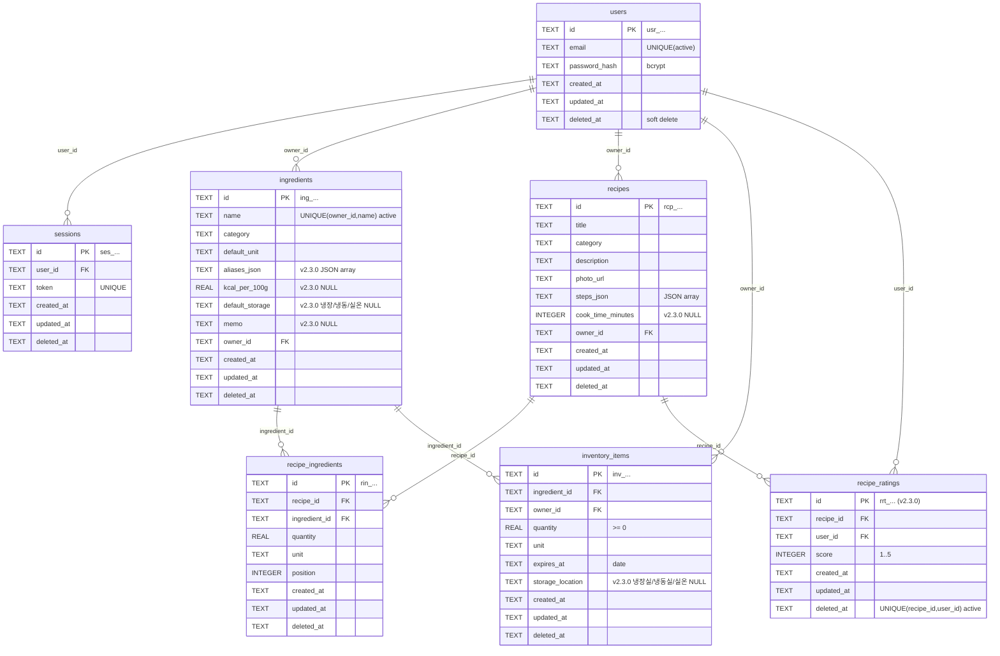

# DB 스키마 & 설계 결정 (server, G3)

- **엔진**: SQLite (파일 기반, 소규모 Q6-a 기준). 접속 파일 경로는 `DB_PATH` 환경변수.
- **스키마 관리**: `server/app/migrations/*.sql` 마이그레이션 파일로만 관리(수동 변경 금지).
  적용 이력은 `schema_migrations` 테이블에 기록해 중복 적용을 방지한다.
- **공통 규칙(api-conventions DB 규칙)**: 테이블명은 복수 snake_case, 모든 테이블에
  `id`, `created_at`, `updated_at` 보유. 삭제는 soft delete(`deleted_at IS NULL` = 활성).
- **타임스탬프**: ISO8601 UTC 문자열 `YYYY-MM-DDTHH:MM:SSZ` 로 저장(응답 date-time 포맷과 동일).
- **식별자**: `<prefix>_<ULID>` 형식(예 `usr_`, `rcp_`, `ing_`, `inv_`, `rin_`, `ses_`, `img_`).
  ULID는 시간 기반이라 사전식 정렬 = 생성순 → 커서 페이지네이션(id 내림차순=최신순)에 활용.

## ERD

## 테이블

### users
| 컬럼 | 타입 | 비고 |
|---|---|---|
| id | TEXT PK | `usr_...` |
| email | TEXT | 활성 행에 한해 UNIQUE (`ux_users_email_active`) |
| password_hash | TEXT | bcrypt 해시 |
| created_at / updated_at | TEXT | |
| deleted_at | TEXT NULL | soft delete |

### sessions
세션 쿠키 인증의 서버측 저장소. 쿠키 값은 `token.HMAC(SECRET_KEY)` 로 서명되어 위변조 탐지.
로그아웃 시 해당 사용자의 활성 세션을 soft delete.
| 컬럼 | 타입 | 비고 |
|---|---|---|
| id | TEXT PK | `ses_...` |
| user_id | TEXT FK→users | |
| token | TEXT UNIQUE | 불투명 랜덤 토큰 (인덱스 `ix_sessions_token`) |
| created_at / updated_at / deleted_at | TEXT | |

### ingredients (회원 개인별 마스터, US-008)
| 컬럼 | 타입 | 비고 |
|---|---|---|
| id | TEXT PK | `ing_...` |
| name | TEXT | |
| category | TEXT NULL | |
| default_unit | TEXT NULL | 기본 단위 |
| aliases_json | TEXT NULL | **[v2.3.0/US-016]** 별칭 배열(JSON, 검색용). 미입력 시 `[]` 또는 NULL |
| kcal_per_100g | REAL NULL | **[v2.3.0/US-016]** 100g당 칼로리. 마스터 참고 필드(영양 자동계산 아님) |
| default_storage | TEXT NULL | **[v2.3.0/US-016]** 기본 보관방법. `냉장`/`냉동`/`실온` 중 하나(CHECK), 그 외 거부 |
| memo | TEXT NULL | **[v2.3.0/US-016]** 자유 메모 |
| owner_id | TEXT FK→users | 개인별 마스터 |
| created_at / updated_at / deleted_at | TEXT | |

- **UNIQUE(owner_id, name) WHERE deleted_at IS NULL** (`ux_ingredients_owner_name_active`):
  같은 회원 내 이름 중복 금지(409 `INGREDIENT_NAME_EXISTS`). 다른 회원은 동일 이름 허용(개인별 마스터, PRD 확정).
- **별칭 검색(US-016)**: `GET /ingredients?q=` 는 `name` 뿐 아니라 `aliases_json` 도 매칭.
  소규모(Q6-a) 기준 `aliases_json LIKE '%q%'` 로 처리한다.
  > **PRD Open Question(별칭 저장 형태)**: 정규화 테이블(`ingredient_aliases`) vs JSON 문자열 중
  > 이번 계약은 응답을 문자열 배열로 노출하고 저장은 `aliases_json`(JSON) 로 확정. 별칭 수/검색량이
  > 커지면 정규화 테이블 + 인덱스로 이관하는 것을 추후 과제로 남긴다(G3 재확인 항목).

### recipes (US-004~007)
| 컬럼 | 타입 | 비고 |
|---|---|---|
| id | TEXT PK | `rcp_...` |
| title | TEXT | 필수 |
| category | TEXT NULL | |
| description | TEXT NULL | 한 줄 설명(선택) |
| photo_url | TEXT NULL | `/uploads/images` 반환 URL |
| steps_json | TEXT | 조리 단계 문자열 배열(JSON), 순서 보존 |
| cook_time_minutes | INTEGER NULL | **[v2.3.0/US-014]** 조리시간(분). ADD COLUMN, 기존 행 NULL |
| owner_id | TEXT FK→users | 소유권 검사(403) |
| created_at / updated_at / deleted_at | TEXT | |

정렬(US-014 `sort=cook_time_asc`): `cook_time_minutes ASC`, NULL 은 뒤로(`ORDER BY cook_time_minutes IS NULL, cook_time_minutes ASC`).

### recipe_ratings (레시피 회원별 별점 집계, US-015 [v2.3.0])
레시피에 대한 **여러 회원**의 평점(1~5)을 저장한다. 레시피 소유자 단일값이 아니라 회원별 집계다.
평균(`AVG(score)`)·평가수(`COUNT(*)`)는 조회 시 계산(소규모 기준; 필요 시 캐시는 추후 과제).
| 컬럼 | 타입 | 비고 |
|---|---|---|
| id | TEXT PK | `rrt_...` |
| recipe_id | TEXT FK→recipes | 인덱스(`ix_recipe_ratings_recipe`) |
| user_id | TEXT FK→users | 평가한 회원 |
| score | INTEGER | 1~5 (CHECK score BETWEEN 1 AND 5) |
| created_at / updated_at / deleted_at | TEXT | |

- **UNIQUE(recipe_id, user_id) WHERE deleted_at IS NULL** (`ux_recipe_ratings_recipe_user_active`):
  1인 1평점. 재평가는 활성 행의 `score`·`updated_at` 갱신(upsert), 평가 수 불변.
  취소(DELETE)는 활성 행 soft delete → `AVG`/`COUNT` 재계산. 평가 0건이면 평균은 null(응답 `rating.average=null`).
  다시 평가 시 기존 soft-deleted 행 재활성 또는 신규 행 삽입(구현 재량, 유니크 제약은 active 기준이라 양쪽 안전).

### recipe_ingredients (레시피-식재료 연결, US-009)
레시피 요청 본문에 임베드된 `ingredients[]` 를 저장. 레시피 저장(생성/수정) 시 기존 활성 연결을
soft delete 후 새로 삽입하는 **전체 교체** 방식.
| 컬럼 | 타입 | 비고 |
|---|---|---|
| id | TEXT PK | `rin_...` |
| recipe_id | TEXT FK→recipes | 인덱스 |
| ingredient_id | TEXT FK→ingredients | 인덱스, 저장 시 소유 마스터인지 검증(400) |
| quantity | REAL | |
| unit | TEXT NULL | |
| position | INTEGER | 표시 순서 |
| created_at / updated_at / deleted_at | TEXT | |

### inventory_items (보유 재고, US-011 [Should])
US-012 부족 재료 대조의 데이터 소스.
| 컬럼 | 타입 | 비고 |
|---|---|---|
| id | TEXT PK | `inv_...` |
| ingredient_id | TEXT FK→ingredients | 저장 시 소유 마스터 검증 |
| owner_id | TEXT FK→users | |
| quantity | REAL | ≥ 0 |
| unit | TEXT NULL | |
| expires_at | TEXT NULL | 유통기한(date) |
| storage_location | TEXT NULL | **[v2.3.0/US-017]** 보관위치. `냉장실`/`냉동실`/`실온` 중 하나(CHECK). 표시·관리용, **매칭 판정 미반영**(Q3-a) |
| created_at / updated_at / deleted_at | TEXT | |

## 주요 설계 결정
1. **인증 = 서명된 세션 쿠키 + 서버측 세션 테이블**. 쿠키는 HttpOnly/SameSite=Lax/Path=/,
   `COOKIE_SECURE=true` 시 Secure. 시크릿(`SECRET_KEY`)은 환경변수로만 주입(하드코딩 금지).
2. **소유권**: recipes/ingredients/inventory 는 `owner_id` 로 소유자만 수정·삭제(403 FORBIDDEN).
   레시피 목록/상세는 공개(비로그인 열람, US-003).
3. **식재료 삭제 참조 검사**(US-008): 레시피/재고에서 참조 중이면 409 `INGREDIENT_IN_USE`
   (details 로 참조 수 안내). `?force=true` 시 참조를 함께 soft delete 후 삭제.
4. **부족 재료 판정**(US-012): 단위 환산 미지원(PRD Open Question) → 동일 단위 기준으로만 비교.
   재고 없음=`missing`, 동일 단위 합계 < 필요량=`insufficient`, 그 외=`sufficient`.
   로그인 + 재고 1건 이상일 때만 `ingredient_availability` 및 재료별 `status` 를 응답에 포함.
5. **커서 페이지네이션**: 커서 = `base64url(json({"id": last_id}))`, id 내림차순 정렬.
   `limit+1` 조회로 `has_more` 판정.
6. **[v2.3.0] 별점 회원별 집계**(US-015): `recipe_ratings` 별도 테이블. 평균/평가수는 조회 시
   `AVG(score)`/`COUNT(*)`(활성 행). 1인 1평점은 `UNIQUE(recipe_id,user_id) active`.
   `PUT /recipes/{id}/rating` upsert, `DELETE` soft delete. 로그인 필수. 평가 0건 → average=null.
7. **[v2.3.0] 홈 대시보드 집계**(US-018, `GET /dashboard`): 로그인 회원 개인 데이터 기반.
   - KPI: 등록 레시피 수 / **매칭률 100%** 레시피 수 / 재고 종수 / 임박(D-3) 재료 수.
   - 패널: 매칭 100% 레시피(RecipeListItem) / 임박 재고(InventoryItem) / 최근 레시피(RecipeListItem).
   - **매칭률 100% 판정 = v1 US-012 부족판정 규칙 승계**(동일 단위 비교, 유통기한·보관위치 미반영, Q3-a).
     대시보드·상세 진행바(US-020)·위저드 추천(US-022)이 **단일 규칙** 공유(정확도 Q7-a).
   - 임박(D-3): `expires_at` 기준 오늘로부터 D-day ≤ 3(오늘=D-0 포함) 활성 재고.
8. **[v2.3.0] 신규 정렬**(US-014/015): `sort=rating_desc`(AVG 내림차순, 평가 없음=NULL 뒤로),
   `sort=cook_time_asc`(오름차순, NULL 뒤로). 값 없는 항목은 항상 마지막.

## 마이그레이션 노트 (v2.3.0, Additive-Only)
- 모든 신규 컬럼은 **`ALTER TABLE ... ADD COLUMN`(nullable) 만** 사용 — 기존 데이터는 NULL 유지, **백필 없음**(Q4-a).
  - `recipes`: `+cook_time_minutes INTEGER NULL`
  - `ingredients`: `+aliases_json TEXT NULL`, `+kcal_per_100g REAL NULL`, `+default_storage TEXT NULL`, `+memo TEXT NULL`
  - `inventory_items`: `+storage_location TEXT NULL`
- 신규 테이블 `recipe_ratings` 는 `CREATE TABLE` + 부분 유니크 인덱스 `ux_recipe_ratings_recipe_user_active`
  (`WHERE deleted_at IS NULL`) + 조회 인덱스 `ix_recipe_ratings_recipe`.
- 기존 컬럼/테이블/인덱스 변경·삭제 없음 → 기존 조회 경로·테스트 무영향(regression-harness additive 준수).
- `default_storage`(냉장/냉동/실온)와 `storage_location`(냉장실/냉동실/실온)의 enum 값이 **서로 다름**에 유의
  (마스터는 보관"방법", 재고는 보관"위치"). CHECK 제약 또는 앱 검증으로 그 외 값 400.

## 정합성 노트 (FE types.ts)
- `web/src/api/types.ts` 상단 주석 "계약에 없는 필드 추가 금지(예: cookTime)" 는
  v2.3.0에서 `cook_time_minutes`·`rating` 이 **계약에 정식 반영**되면서 **해제 예정**이다.
  실제 types.ts/주석 수정은 **frontend-dev(G3/G4) 몫** — 이번 G2에서는 계약·스키마만 확정하고 FE 코드는 건드리지 않는다.
  주의: 계약 필드명은 스네이크 케이스 `cook_time_minutes`(FE 임의 `cookTime` 아님).

## 미구현/유예 (계약에는 존재, 이번 범위 밖)
- US-013 추천(보유 재료 기반): `GET /recipes` 의 `available_only`, `sort=missing_asc` 파라미터는
  계약대로 수용하지만 정렬/필터에 반영하지 않음(recent 고정). 추후 과제.
- 단위 환산(g↔개 등) 미지원(PRD Open Question).
- **[v2.3.0 계약만 확정, 구현 G3]**: 위 신규 컬럼/테이블/엔드포인트는 이번 단계(G2)에서
  계약·스키마 문서까지만 확정. 서버 구현·마이그레이션 SQL·테스트는 G3에서 진행.
